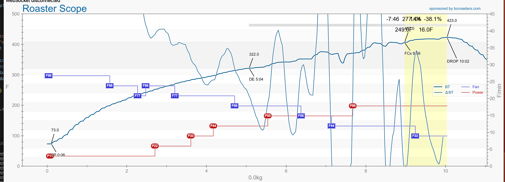

# Artisan Websocket Server - with Thermoworks Bluedot Thermometer

A 65-line script that starts a websocket server, connects to a nearby Thermoworks Bluedot thermometer, and responds to Artisan's requests for temperature updates.



(My first roast using Artisan and this script)

## Description

When roasting coffee beans, it's important to monitor the temperature of the beans as they roast.

Artisan is a free, open-source software that allows you to monitor the temperature of the beans as they roast.

While it's not required, it's certainly very helpful to automatically log the temperature and other data from the roast.  Artisan can do this, but it requires a device that can connect to the thermometer and send the data to Artisan.  This script allows you to use a Thermoworks Bluedot thermometer to send the data to Artisan through a websocket connection.

## Getting Started

### Dependencies

* Artisan
* Node (I'm using 18.18.0)
* Installing Nobel bluetooth client dependencies based on your OS:
  * https://github.com/abandonware/noble

### Executing program

```
npm install
node index.js
```

If this is your first time setting up Artisan, I highly recommend watching [this video](https://www.youtube.com/watch?v=4VFM4jvDLi8) by The Captain's Coffee.  It's a great beginner's guide to Artisan.

* Config > Device > ET/BT > Meter > Set to Websocket
* Config > Ports > Websocket > Set Port 8080
  * Input 1: Request = getBT, Node = BT, Mode = F

## Help

* If you're having trouble accessing the bluetooth device, you may have to go into the settings to allow your terminal or code editor to have access to Bluetooth. For example, on a Mac, you may have to go to System Preferences > Security & Privacy > Privacy > Bluetooth and check the box next to your terminal or code editor.

## Authors

Roger Lam

## License

This project is licensed under the MIT License - see the LICENSE.md file for details

## Acknowledgments

* [Artisan Beginner Guide by The Captain's Coffee](https://www.youtube.com/watch?v=4VFM4jvDLi8)
* [Thermoworks Bluedot](https://www.thermoworks.com/bluedot/)
